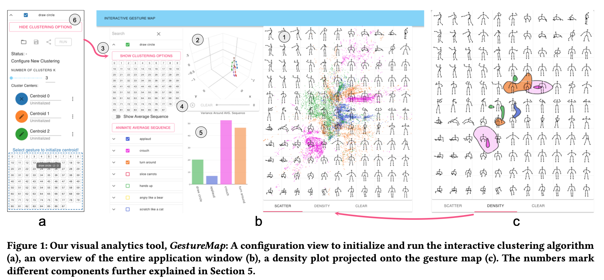

> **GestureMap: Supporting Visual Analytics and Quantitative Analysis of Motion Elicitation Data by Learning 2D Embedding**<br>
> Hai Dang<sup>1</sup>, Daniel Buschek<sup>1</sup><br>
> <sup>1</sup>University of Bayreuth<br>
> https://arxiv.org/pdf/2103.00912.pdf
>
> <p align="justify"><b>Abstract:</b> <i>This paper presents GestureMap, a visual analytics tool for gesture elicitation which directly visualises the space of gestures. Con- cretely, a Variational Autoencoder embeds gestures recorded as 3D skeletons on an interactive 2D map. GestureMap further integrates three computational capabilities to connect exploration to quan- titative measures: Leveraging DTW Barycenter Averaging (DBA), we compute average gestures to 1) represent gesture groups at a glance; 2) compute a new consensus measure (variance around average gesture); and 3) cluster gestures with k-means. We evaluate GestureMap and its concepts with eight experts and an in-depth analysis of published data. Our findings show how GestureMap facilitates exploring large datasets and helps researchers to gain a visual understanding of elicited gesture spaces. It further opens new directions, such as comparing elicitations across studies. We discuss implications for elicitation studies and research, and opportunities to extend our approach to additional tasks in gesture elicitation.
</i></p>
> <p align="justify"><b>Video:</b> 
> https://youtu.be/4HYbMak47fs

## Setup
See the [setup instructions](SETUP.md).

## System tested with

- Cuda Toolkit version 10+
- Python version 3.6
- MongoDB running on default port (27017)


## Citation
```
@inproceedings{dang2021gesturemap,
  title     = {GestureMap: SupportingVisual Analytics and Quantitative Analysis of Motion Elicitation Data by Learning 2D Embeddings},
  author    = {Hai Dang and Daniel Buschek},
  booktitle = {ACM Conference on Human Factors in Computing Systems},
  year      = {2021}
}
```

## License

The code of this repository is released under the [Apache 2.0](LICENSE) license.<br>
